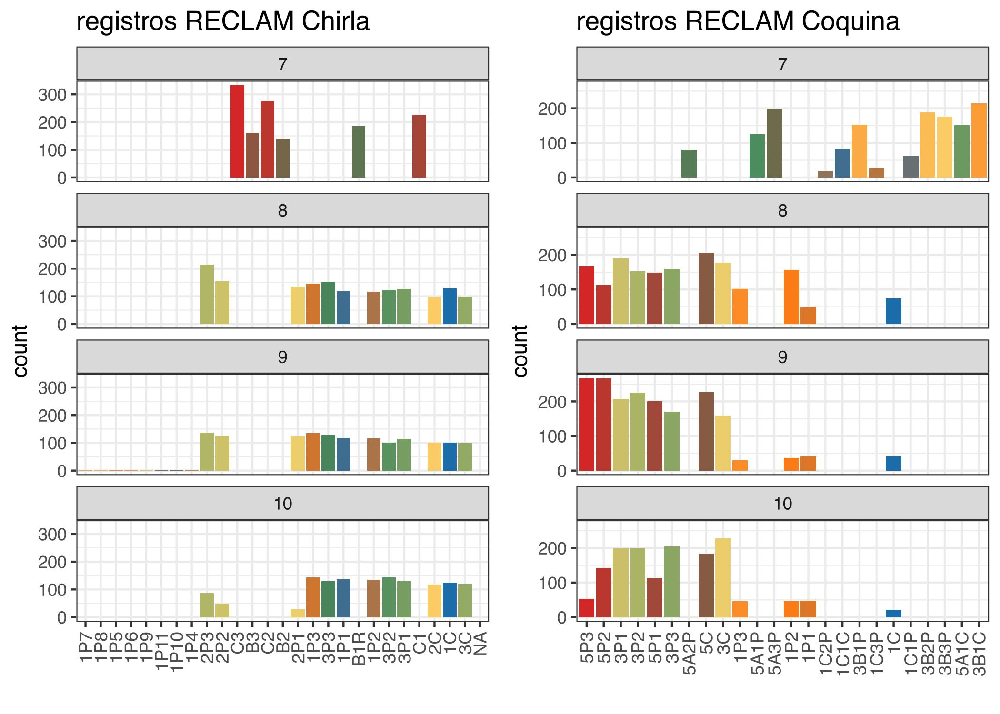

``` r
rm(list = ls())
knitr::opts_chunk$set(echo = TRUE,
                      message = FALSE,
                      warning = FALSE,
                      fig.align = 'center',
                      dev = 'jpeg',
                      dpi = 300, 
                      fig.align='center')
#XQuartz is a mess, put this in your onload to default to cairo instead
options(bitmapType = "cairo") 
# (https://github.com/tidyverse/ggplot2/issues/2655)
# Lo mapas se hacen mas rapido
```


``` r
library(tidyverse)
library(ggridges)
library(readxl)
library(here)
library(lubridate)
library(readr)
library(ggthemes)
library(hrbrthemes)
library(kableExtra)
library(gtsummary)
library(easystats)
library(sf)
library(egg)
```
Seteo el directorio


# Contexto de las composiciones de tallas del monitoreo de Coquina y Chirla 

El monitoreo de tallas considera dos compenentes. muestreo espacial, temporal y por arte de pesca (comercial y poblacional)

# Metodología de manipulación de data

Leer y juntar Data Base  provenientos de todos los muestreos. Cabe señalar que las bases de datos previas al 2020, tiene (o pueden contener) otras columnas como densidad, rendimiento y tallas. 


## Datos Composiciones de Tallas

### Chirla


``` r
# Leo todos los archivos de Chirla
archivoagosto <- "DATA/Chirla 09_08_2024.xlsx"
archivojunio <- "DATA/Chirla 25_07_2024.xlsx"
archivo_sept <- "DATA/Chirla 16_09_2024.xlsx"  # Cambiar el nombre del archivo para septiembre
archivo_oct <- "DATA/Chirla 23_10_2024.xlsx"  # Cambiar el nombre del archivo para octubre

# Función para leer y combinar hojas de un archivo
leer_y_combinar <- function(archivo) {
    hojas <- excel_sheets(archivo)
  hojas_filtradas <- hojas[!hojas %in% c("Comercial", "Datos lance")]
  datos <- lapply(hojas_filtradas, function(hoja) {
    read_excel(archivo, sheet = hoja)
  }) %>%
    bind_rows()
  return(datos)
}
```

Leemos los archivos y combina los resultados


``` r
total <- bind_rows(
  leer_y_combinar(archivo_sept),
  leer_y_combinar(archivojunio),
  leer_y_combinar(archivoagosto),
  leer_y_combinar(archivo_oct)   
)
```

Miro `NA`


``` r
colSums(is.na(total))
```

```
##  LONG FECHA  ZONA 
##     0     0    38
```

Ahoira con Coquina


``` r
# Leo todos los archivos de Chirla
archivojunio_c <- "DATA/Coquina 24_07_2024.xlsx"
archivoagosto_c <- "DATA/Coquina 20_08_2024.xlsx"
archivo_sept_c <- "DATA/Coquina 20_09_2024.xlsx"  
archivo_oct_c <- "DATA/Coquina 18_10_2024.xlsx"  

leer_y_combinar_c <- function(archivo) {
  hojas <- excel_sheets(archivo)
  hojas_filtradas <- hojas[!hojas == "Datos Lance"]
  datos_c <- lapply(hojas_filtradas, function(hoja) {
    datos_hoja <- read_excel(archivo, sheet = hoja)
    datos_hoja$ZONA <- hoja  # Agrega la columna ZONA con el nombre de la hoja
    return(datos_hoja)
  }) %>%
    bind_rows()  # Combina todas las hojas en un solo data frame
  return(datos_c)
}
```


``` r
# Lee los archivos y combina los datos
datos_junio_c <- leer_y_combinar_c(archivojunio_c)
datos_agosto_c <- leer_y_combinar_c(archivoagosto_c)
datos_sept_c <- leer_y_combinar_c(archivo_sept_c)
datos_oct_c <- leer_y_combinar_c(archivo_oct_c)

# Combina todos los datos en un solo data frame
total_c <- bind_rows(datos_junio_c, 
                             datos_agosto_c, 
                             datos_sept_c, 
                             datos_oct_c)
```

# Elimina el punto en la columna ZONA


``` r
total_c$ZONA <- gsub("\\.", "", total_c$ZONA)
# Verifica los cambios
head(total_c)
```

```
## # A tibble: 6 × 4
##   Longitud Fecha                Zona ZONA 
##      <dbl> <dttm>              <dbl> <chr>
## 1     18.9 2024-07-24 00:00:00     5 5A1C 
## 2     28.2 2024-07-24 00:00:00     5 5A1C 
## 3     27.8 2024-07-24 00:00:00     5 5A1C 
## 4     27.2 2024-07-24 00:00:00     5 5A1C 
## 5     19.8 2024-07-24 00:00:00     5 5A1C 
## 6     28.1 2024-07-24 00:00:00     5 5A1C
```
Que significan las letras y numeros?


``` r
chplot <- ggplot(total %>%
                   mutate(ANO = year(FECHA),
                          MES = month(FECHA),
                          DIA = day(FECHA))) +
  geom_bar(aes(x = reorder(ZONA, LONG), 
               fill = ZONA), stat = "count") +
  theme_bw() +
  theme(axis.text.x = element_text(angle = 90,
                                   hjust = 1,
                                   vjust = 0.5,
                                   size = 9),
        legend.position = "none") +
  facet_wrap(. ~ MES, ncol = 1) +
  scale_fill_see_d(palette = "contrast") +
  labs(x = "") +
  ggtitle('registros RECLAM Chirla')


coplot_c <- ggplot(total_c %>%
                   mutate(ANO = year(Fecha),
                          MES = month(Fecha),
                          DIA = day(Fecha))) +
  geom_bar(aes(x = reorder(ZONA, Longitud), 
               fill=ZONA), stat = "count") +
  theme_bw()+
   theme(axis.text.x = element_text(angle = 90,
                                     hjust = 1,
                                     vjust = 0.5,
                                     size = 9),
         legend.position = "none")+
  facet_wrap(.~MES, ncol=1)+
  scale_fill_see_d(palette = "contrast")+
  labs(x="")+
  ggtitle('registros RECLAM Coquina')


ggarrange(chplot,
          coplot_c,
          ncol=2)
```



Ahora un hist simple


``` r
chhist <- ggplot(total %>%
                     mutate(ANO = year(FECHA),
                            MES = month(FECHA),
                            DIA = day(FECHA))
                    )+
  geom_histogram(aes(x=LONG), bins = 60,
                 fill=NA,
                 col=1) +
  theme_bw()+
   theme(axis.text.x = element_text(angle = 90,
                                     hjust = 1,
                                     vjust = 0.5,
                                     size = 9),
         legend.position = "none")+
  facet_wrap(.~MES, ncol=1)+
  labs(x="")+
  ggtitle('RECLAM Chirla')

cohist<- ggplot(total_c %>%
                     mutate(ANO = year(Fecha),
                            MES = month(Fecha),
                            DIA = day(Fecha))
                    )+
  geom_histogram(aes(x=Longitud), bins = 60,
                 fill=NA,
                 col=2) +
  theme_bw()+
   theme(axis.text.x = element_text(angle = 90,
                                     hjust = 1,
                                     vjust = 0.5,
                                     size = 9),
         legend.position = "none")+
  facet_wrap(.~MES, ncol=1)+
  labs(x="")+
  ggtitle('RECLAM Coquina')


ggarrange(chhist,
          cohist,
          ncol=2)
```


## Relacion Talla Peso

Análisis recopilados desde este [Repo](https://rpubs.com/jdmaestre/366409) and [this](http://derekogle.com/fishR/examples/oldFishRVignettes/LengthWeight.pdf)
Estos datos fueron muestreados solo durante el mes de Junio 2024.


``` r
tp_coquina <- read_excel(here("DATA",
                              "Muestreo 200 ejemplares.xlsx"), 
    sheet = "coquina") %>% 
  mutate(specie = "CQ")
tp_chirla <- read_excel(here("DATA",
                              "Muestreo 200 ejemplares.xlsx"), 
    sheet = "chirla") %>%
  mutate(specie = "CH")

tpcqch <- rbind(tp_chirla,
                tp_coquina)

#Crear el gráfico con los datos originales y la línea de regresión ajustada
TP <- ggplot(tpcqch) +
  geom_point(aes(Longitud, Peso, color = specie)) +
  geom_smooth(aes(Longitud, Peso),
              method = "gam",
              color = "black",
              se = TRUE) +
  facet_wrap(.~specie, scale = "free_y") +
  theme_few()

TP
```


parámetros 


``` r
# Transformación logarítmica de Longitud y Peso
tpcqch_log <- tp_coquina %>%
  mutate(log_Longitud = log(Longitud),
         log_Peso = log(Peso))

# Ajustar un modelo lineal para todas las especies (combinadas)
modelo_completo <- lm(log_Peso ~ log_Longitud , data = tpcqch_log )

# Realizar el ANOVA para evaluar si las pendientes difieren entre especies
anova_resultados <- anova(modelo_completo)

# Ver los resultados del ANOVA
print(anova_resultados)
```

```
## Analysis of Variance Table
## 
## Response: log_Peso
##               Df Sum Sq Mean Sq F value    Pr(>F)    
## log_Longitud   1 160.68 160.682   10458 < 2.2e-16 ***
## Residuals    192   2.95   0.015                      
## ---
## Signif. codes:  0 '***' 0.001 '**' 0.01 '*' 0.05 '.' 0.1 ' ' 1
```

``` r
# Ver los coeficientes del modelo
coef(modelo_completo)
```

```
##  (Intercept) log_Longitud 
##    -8.786510     2.917786
```

``` r
# Extraer los coeficientes
intercepto_log <- coef(modelo_completo)["(Intercept)"]  # Intercepto en log
pendiente_log <- coef(modelo_completo)["log(Longitud)"]  # Pendiente en log

# Calcular el intercepto en el espacio original (exponencial del intercepto logarítmico)
intercepto_absoluto <- exp(intercepto_log)

# Mostrar los resultados
cat("Intercepto (log):", intercepto_log, "\n")
```

```
## Intercepto (log): -8.78651
```

``` r
cat("Pendiente (log):", pendiente_log, "\n")
```

```
## Pendiente (log): NA
```

``` r
cat("Intercepto (absoluto):", intercepto_absoluto, "\n")
```

```
## Intercepto (absoluto): 0.0001527802
```

``` r
# Crear el gráfico con los datos originales y la línea de regresión ajustada
TP <- ggplot(tp_coquina) +
  geom_point(aes(Longitud, Peso, color = specie)) +
  geom_smooth(aes(Longitud, Peso),
              method = "gam",
              color = "black",
              se = TRUE) +
  facet_wrap(.~specie, scale = "free_y") +
  theme_bw()

TP
```


``` r
# step-2
plot(parameters(modelo_completo))
```


``` r
# step-3

check <- check_normality(modelo_completo)
plot(check, 
     type="qq")
```


``` r
results <- summary(correlation(tpcqch_log))
plot(results, show_data = "points")
```


# Mapas 

Preguntar a Alejandro si todos los "Datos Lance" tienen la misma Info. Por q no tiene Oct?


``` r
coord_ch <- read_excel(here("DATA",
                    "Chirla 09_08_2024.xlsx"),
                    sheet = "Datos lance") %>% 
  dplyr::select(1, 2,3) %>% 
  rename(ZONA = Punto,
         Latitud =`Latitud inicio`,
         Longitud = `Longitud inicio`)

coord_co <- read_excel(here("DATA",
                    "Coquina 20_08_2024.xlsx"),
                    sheet = "Datos Lance") %>% 
  dplyr::select(c(2,4,5)) %>% 
  rename(ZONA = Réplica)

coord_bo <- rbind(coord_ch,
                  coord_co)
```
Unir base con `merge()`

(revisar!)


``` r
total_c_geo <- merge(total_c, 
                     coord_bo,
                     by="ZONA")
head(total_c_geo)
```

```
##   ZONA Longitud.x      Fecha Zona  Latitud Longitud.y
## 1   1C      26.09 2024-10-18    1 36.48166    6.23718
## 2   1C      25.77 2024-10-18    1 36.48166    6.23718
## 3   1C      27.77 2024-08-20    1 36.48166    6.23718
## 4   1C      25.70 2024-08-20    1 36.48166    6.23718
## 5   1C      23.13 2024-08-20    1 36.48166    6.23718
## 6   1C      24.68 2024-08-20    1 36.48166    6.23718
```

Leo un .shp


``` r
costandalucia <- st_read("~/IEO/IN_BENTOS/SHP_Chirla/costa_proyectada.shp") %>% 
  st_transform("+init=epsg:4326")
```

```
## Reading layer `costa_proyectada' from data source 
##   `/Users/mauriciomardones/IEO/IN_BENTOS/SHP_Chirla/costa_proyectada.shp' 
##   using driver `ESRI Shapefile'
## Simple feature collection with 10 features and 4 fields
## Geometry type: POLYGON
## Dimension:     XY
## Bounding box:  xmin: -34115.27 ymin: 3891271 xmax: 301588.8 ymax: 4173659
## Projected CRS: WGS_1984_Complex_UTM_Zone_30N
```

``` r
grilla <- st_read("~/IEO/IN_BENTOS/SHP_Chirla/cuadrกculas_definitivo.shp") %>% 
  st_transform("+init=epsg:4326")
```

```
## Reading layer `cuadrกculas_definitivo' from data source 
##   `/Users/mauriciomardones/IEO/IN_BENTOS/SHP_Chirla/cuadrกculas_definitivo.shp' 
##   using driver `ESRI Shapefile'
## Simple feature collection with 250 features and 1 field
## Geometry type: POLYGON
## Dimension:     XY
## Bounding box:  xmin: 109273.6 ymin: 4071852 xmax: 198073.5 ymax: 4125446
## Projected CRS: ETRS89 / UTM zone 30N
```


``` r
# Crear un data frame con las coordenadas y un atributo para el tamaño
puntos <- data.frame(
  lon = c(-7.2, -7.0, -6.8, -6.5),
  lat = c(36.8, 36.9, 37.1, 37.2),
  captura = c(10, 25, 50, 100)  # atributo para definir el tamaño
)
# Graficar el mapa y añadir puntos de diferentes tamaños
ggplot() +
  geom_point(data = puntos, 
             aes(x = lon,
                 y = lat, 
                 size = captura), 
             color = "blue", 
             alpha = 0.7) +
  geom_sf(data = costandalucia, 
          fill = "#fee8c8") + 
  theme_few() +
  xlab(expression(paste(Longitude^o, ~'O'))) +
  ylab(expression(paste(Latitude^o, ~'S'))) +
  guides(size = guide_legend(title = "Talla Promedio (mm)")) +  # Título de la leyenda
  scale_size_continuous(range = c(3, 10)) +  # Ajuste del tamaño de los puntos
  theme(legend.position = "right") +  # Posición de la leyenda
  xlim(-7.6, -6.3) +
  ylim(36.65, 37.3)
```


# Referencias
